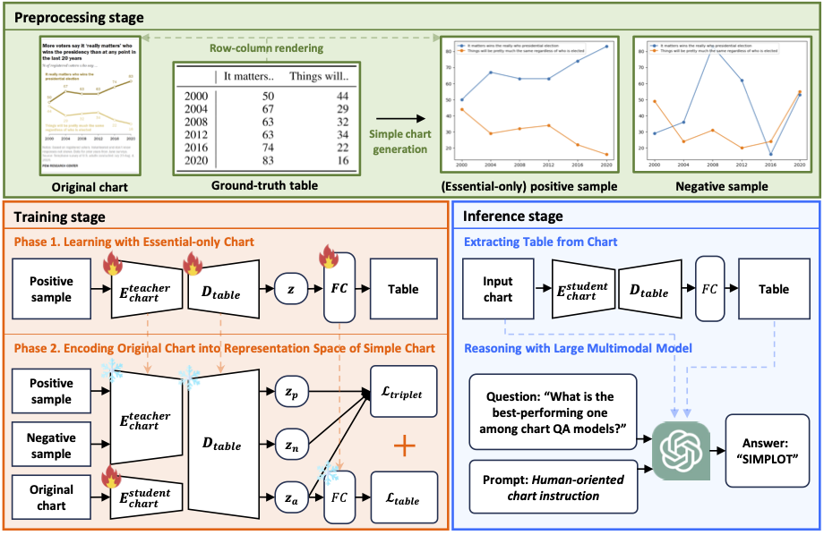

# Simplot

The official source code for **SIMPLOT: Enhancing Chart Question Answering by Distilling Essentials**


## Overview
Recently, interpreting charts with complex and logical reasoning have emerged as substantial challenges due to the development of vision-language models. A prior state-of-the-art (SOTA) model, Deplot, has presented an end-to-end method that leverages the vision-language model to convert charts into table format utilizing Large Language Models (LLMs) for reasoning. However, unlike natural images, charts contain a mix of essential and irrelevant information required for chart reasoning, and we discover that this characteristic can lower the performance of chart-to-table extraction. In this paper, we introduce *Simplot*, a method designed to extract only the elements necessary for chart reasoning. The proposed method involves two steps: 1) training to mimic a simple plot that contains only the essential information from a complex chart for table extraction, followed by 2) performing reasoning based on the table. Our model enables accurate chart reasoning without the need for additional annotations or datasets, and its effectiveness is demonstrated through various experiments. Furthermore, we propose a novel prompt addressing the shortcoming of recent SOTA model, ignoring visual attributes such as color.

</img> 

## Environment

You can configure the environment used during the experiments by entering the following code.

```bash
conda create -n Simplot python=3.8 
conda activate Simplot 
pip install -r requirements.txt
```


## Training

### Dataset Preparation

You can download the dataset from following github repository: [huggingface repository](https://huggingface.co/datasets/ahmed-masry/ChartQA).

Another component used for training and experimentation can be downloaded and preprocessed through the following code.

```bash
cd data/ 
unzip test.zip
cd ..
python preprocess.py
```

And set the directory as follows:

```
data/
├── data                   
│   ├── train   
│   │   ├── train_augmented.json 
│   │   ├── train_human.json    
│   │   ├── annotations           
│   │   ├── png                  
│   │   ├── tables                
│   │   ├── positive_png          # Positive Chart Images Folder
│   │   ├── negative_png          # Negative Chart Images Folder
│   │   ├── columns               # Ground-Truth Columns Folder
│   │   ├── indexes               # Ground-Truth Indexes Folder
│   └── val  
│   │   │   ...
│   │   │   ...
│   └── test  
│   │   ├── gpt_columns           # GPT-Extracted Columns Folder
│   │   ├── gpt_indexes           # GPT-Extracted Indexes Folder
│   │   │   ...
│   │   │   ...
```
### Phase 1:

```python
python main.py --phase 1
```
### Phase 2:

```python
python main.py --phase 2 --state_path './state/phase_1_best_model.pth' --lr 1e-5 
```

## Inference

After training step, the python code will automatically save the checkpoints in `./state/`. With the saved checkpoints, you can evaluate RD and test ChartQA. 

### Evaluate RD

```python
python inference.py
```

### ChartQA

```python
python QA.py --api_key 'your api key' --qa_type 'human or augmented' 
```

## OpenCQA

### Dataset Preparation

You can download the opencqa dataset from following github repository: [github repository](https://github.com/vis-nlp/OpenCQA).

Another component used for experimentation can be downloaded and preprocessed through the following code (You can use a previously trained model without any additional training).

```bash
cd data/opencqa/test/
unzip test.zip
cd ../../../
python preprocess_opencqa.py
```

And set the directory as follows:

```
data/
├── opencqa                   
│   ├── baseline_models      
│   ├── bboxes
│   ├── chart_images      
│   ├── ...         
│   └── test  
│   │   ├── gpt_columns           # GPT-Extracted Columns Folder
│   │   ├── gpt_indexes           # GPT-Extracted Indexes Folder
│   │   │── img
```

### Inference 


```python
python inference.py --img_path './data/opencqa/test/img/' --row_path './data/opencqa/test/gpt_indexes/' --col_path './data/opencqa/test/gpt_columns/' --inference_type 'opencqa/'
```

### Open-ended Question Answering 

```python
python opencqa.py --api_key 'your api key' 
```